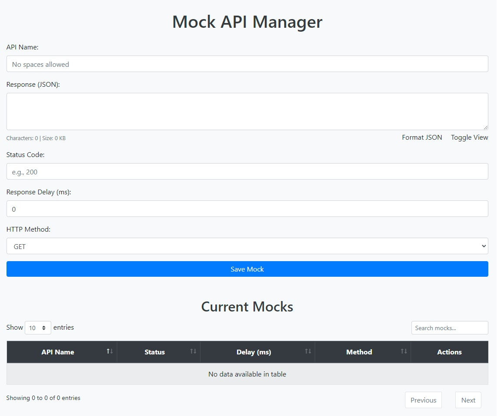

# Mock API Manager

A dynamic mock API server built with [Rust](https://www.rust-lang.org/) and [Actix Web](https://actix.rs/). This server allows for easy creation, editing, and deletion of mock API responses, with support for dynamic responses based on request parameters, body content, headers, arrays, and more.

## Table of Contents

- [Overview](#overview)
- [Features and Capabilities](#features-and-capabilities)
- [Prerequisites](#prerequisites)
- [Deployment](#deployment)
    - [Deploying with Kubernetes](#deploying-with-kubernetes)
- [Usage](#usage)
    - [Access the Web API Manager](#access-the-web-api-manager)
    - [Capabilities of the Web UI](#capabilities-of-the-web-ui)
    - [Managing Mocks via Web Interface](#managing-mocks-via-web-interface)
    - [Dynamic Response Generation](#dynamic-response-generation)
        - [Query Parameters](#query-parameters)
        - [Headers](#headers)
        - [JSON Body Fields](#json-body-fields)
        - [Arrays and Nested JSON](#arrays-and-nested-json)
        - [Path Parameters](#path-parameters)
        - [Built-in Handlebars Helpers](#built-in-handlebars-helpers)
- [Example Usage with curl](#example-usage-with-curl)
- [Contributing](#contributing)
- [License](#license)

## Overview

**Mock API Manager** is a powerful tool for developers and testers who need to simulate API endpoints without building the actual backend services. It's ideal for frontend development, integration testing, and simulating various API behaviors in development and testing environments.

Built with high-performance Rust and Actix Web, the Mock API Manager offers dynamic mock responses, placeholder replacement, and an intuitive web interface for managing your mocks.

## Features and Capabilities

1. **Dynamic Mock Responses**:
    - **HTTP Method Support**: Supports `GET`, `POST`, `PUT`, and `DELETE`.
    - **Custom Status Codes**: Return any valid HTTP status code.
    - **Response Delay Simulation**: Add artificial delays to responses to simulate network latency.
    - **Configurable Response Bodies**: Define custom JSON responses, including dynamic content.

2. **Dynamic Placeholder Replacement**:
    - **Request-based Placeholders**: Replace placeholders in responses with values from query parameters, headers, JSON body fields, arrays, or path parameters.
    - **Built-in Helpers**: Use Handlebars helpers for dynamic data generation, such as timestamps, random numbers, and strings.

3. **Web API Manager**:
    - **Intuitive Interface**: Manage mocks via a web-based form with real-time validation and feedback.
    - **Mock List Management**: View, edit, or delete existing mocks directly from the interface.
    - **Syntax Highlighting**: Enhanced JSON editing experience with syntax highlighting and formatting tools.

4. **High Performance**:
    - **Built with Rust**: Leveraging Rust's speed and safety for high throughput and low latency.
    - **Optimized Server**: Actix Web ensures efficient handling of concurrent connections.

5. **Logging and Debugging**:
    - **Environment-based Logging**: Integrated logging with `env_logger` for tracking and debugging.
    - **Error Handling**: Comprehensive error messages for easier troubleshooting.

6. **Scalability**:
    - **In-memory Storage**: Efficient storage of mocks for fast access.
    - **Designed for Load-Balancing**: Ready for deployment in scalable environments.

## Prerequisites

- **Kubernetes**: To deploy the application using Kubernetes.
- **kubectl**: Kubernetes command-line tool to interact with your cluster.

## Deployment

### Deploying with Kubernetes

You can deploy the Mock API Manager to your Kubernetes cluster using the provided `deployment.yaml`, `service.yaml` and `headless-service.yaml` files.

1. **Apply the Deployment Configuration**:

   ```bash
   kubectl apply -f deployment.yaml
   ```

2. **Apply the Service Configuration**:

   ```bash
   kubectl apply -f service.yaml
   ```

3. **Verify the Deployment**:

   ```bash
   kubectl get deployments
   kubectl get services
   ```

   Ensure that the deployment and service are running correctly.

4. **Access the Application**:

   Depending on your cluster setup, you might need to use port forwarding or expose the service externally.

    - **Port Forwarding**:

      ```bash
      kubectl port-forward service/mock-api-manager 8080:8080
      ```

      Now, you can access the application at `http://localhost:8080`.

    - **External Access**:

      If your service is exposed externally (e.g., using a LoadBalancer), access the application using the external IP.

## Usage

### Access the Web API Manager

Open your browser and navigate to `http://localhost:8080` (or the appropriate external IP) to access the Mock API Manager's web interface.

### Capabilities of the Web UI

The web interface of the Mock API Manager provides a user-friendly dashboard to manage your mock APIs effectively.

- **Dashboard Overview**:
    - **Real-time Statistics**: View the total number of mocks, recent activity, and system status.
    - **Search and Filter**: Easily find mocks using search functionality and filters.

- **Mock Management**:
    - **Create New Mocks**: Define new mock endpoints with customized responses.
    - **Edit Existing Mocks**: Update the configurations of your mocks seamlessly.
    - **Delete Mocks**: Remove mocks that are no longer needed.

- **Response Configuration**:
    - **JSON Editor**: A built-in JSON editor with syntax highlighting and validation.
    - **Dynamic Placeholders**: Insert placeholders in responses for dynamic data rendering.
    - **Response Preview**: Preview how the response will look before saving.

- **Theme Customization**:
    - **Settings Menu**: Personalize the interface with different themes and background colors.
    - **Persistent Settings**: Your theme preferences are saved for future sessions.

- **Help and Documentation**:
    - **Guided Tutorials**: Access step-by-step guides directly from the UI.
    - **API Reference**: Quick access to API endpoints and usage examples.

<div style="text-align: center;">
  
  <div style="margin-top: 10px;">
    <b>Figure:</b> Mock API Manager Dashboard
  </div>
</div>

### Managing Mocks via Web Interface

The Web API Manager provides an intuitive interface for creating, editing, and deleting mocks.

- **Create a New Mock**:
    1. Fill in the fields in the form:
        - **API Name**: Unique identifier for your mock API endpoint (no spaces allowed).
        - **Response**: JSON-formatted response body, can include Handlebars placeholders like `{{username}}`.
        - **Status Code**: HTTP status code to return (e.g., 200, 404).
        - **Response Delay**: Optional delay in milliseconds to simulate network latency.
        - **HTTP Method**: HTTP method to which this mock should respond (`GET`, `POST`, etc.).
    2. Click **Save Mock** to create the mock API.

- **Edit an Existing Mock**:
    - Click the **Edit** button next to the mock entry in the **Current Mocks** table. The form will auto-fill with the mock's current data for editing.
    - Make the necessary changes and click **Save Mock**.

- **Delete a Mock**:
    - Click the **Delete** button next to the mock entry to remove it.

### Dynamic Response Generation

The Mock API Manager supports dynamic content in responses using Handlebars templating. You can include placeholders that will be replaced with values from the incoming request or generated dynamically.

#### Query Parameters

**Usage**: Access query parameters from the URL.

**Example**:

- **Request**:

  ```bash
  GET /mock/user-info?username=JohnDoe
  ```

- **Response Template**:

  ```json
  {
    "message": "Hello, {{username}}"
  }
  ```

- **Resulting Response**:

  ```json
  {
    "message": "Hello, JohnDoe"
  }
  ```

#### Headers

**Usage**: Access values from request headers.

**Example**:

- **Request**:

  ```bash
  GET /mock/header-example
  ```

  Header:

  ```
  X-Custom-Header: CustomValue
  ```

- **Response Template**:

  ```json
  {
    "received_header": "{{X-Custom-Header}}"
  }
  ```

- **Resulting Response**:

  ```json
  {
    "received_header": "CustomValue"
  }
  ```

#### JSON Body Fields

**Usage**: Access fields from a JSON request body.

**Example**:

- **Request**:

  ```bash
  POST /mock/login
  Content-Type: application/json

  {
    "username": "JaneDoe",
    "password": "secret"
  }
  ```

- **Response Template**:

  ```json
  {
    "status": "User {{username}} logged in successfully"
  }
  ```

- **Resulting Response**:

  ```json
  {
    "status": "User JaneDoe logged in successfully"
  }
  ```

#### Arrays and Nested JSON

**Usage**: Access elements within arrays and nested JSON structures in the request body.

**Example**:

- **Request**:

  ```bash
  POST /mock/process-items
  Content-Type: application/json

  {
    "items": [
      {"id": 1, "name": "ItemOne"},
      {"id": 2, "name": "ItemTwo"}
    ],
    "total": 2
  }
  ```

- **Response Template**:

  ```json
  {
    "processed_items": [
      {{#each items}}
      {
        "item_id": "{{id}}",
        "item_name": "{{name}}"
      }{{#unless @last}},{{/unless}}
      {{/each}}
    ],
    "total_items": "{{total}}"
  }
  ```

- **Resulting Response**:

  ```json
  {
    "processed_items": [
      {
        "item_id": "1",
        "item_name": "ItemOne"
      },
      {
        "item_id": "2",
        "item_name": "ItemTwo"
      }
    ],
    "total_items": "2"
  }
  ```

**Explanation**:

- The `{{#each items}}...{{/each}}` block iterates over the `items` array in the request body.
- `{{id}}` and `{{name}}` access the fields of each item.
- `{{#unless @last}},{{/unless}}` adds a comma between items, except after the last item.

#### Path Parameters

**Usage**: While the current implementation uses `api_name` as a fixed segment in the URL, you can simulate path parameters within the `api_name` by defining dynamic endpoints.

**Example**:

- **API Name**: `user-{{userId}}`

- **Response Template**:

  ```json
  {
    "userId": "{{userId}}",
    "details": "Details for user {{userId}}"
  }
  ```

- **Request**:

  ```bash
  GET /mock/user-42
  ```

- **Resulting Response**:

  ```json
  {
    "userId": "42",
    "details": "Details for user 42"
  }
  ```

**Note**: This approach treats the user ID as part of the `api_name`. Adjust your mock definitions accordingly.

#### Built-in Handlebars Helpers

The Mock API Manager includes several built-in helpers to generate dynamic content.

1. **`current_datetime`**: Inserts the current date and time.

    - **Usage**: `{{current_datetime "format"}}`
    - **Example**:

      ```json
      {
        "timestamp": "{{current_datetime \"%Y-%m-%d %H:%M:%S\"}}"
      }
      ```

    - **Resulting Response**:

      ```json
      {
        "timestamp": "2024-11-09 12:34:56"
      }
      ```

2. **`random_number`**: Generates a random number within a specified range.

    - **Usage**: `{{random_number min max}}`
    - **Example**:

      ```json
      {
        "verification_code": "{{random_number 1000 9999}}"
      }
      ```

    - **Resulting Response**:

      ```json
      {
        "verification_code": "4821"
      }
      ```

3. **`ordered_number`**: Generates an incrementing number each time it is called.

    - **Usage**: `{{ordered_number}}`
    - **Example**:

      ```json
      {
        "order_id": "{{ordered_number}}"
      }
      ```

    - **Resulting Response**:

      ```json
      {
        "order_id": "1"
      }
      ```

4. **`random_string`**: Generates a random string matching a given regex pattern.

    - **Usage**: `{{random_string "regex_pattern"}}`
    - **Example**:

      ```json
      {
        "session_token": "{{random_string \"[A-Za-z0-9]{16}\"}}"
      }
      ```

    - **Resulting Response**:

      ```json
      {
        "session_token": "a1B2c3D4e5F6g7H8"
      }
      ```


**Note**: When using special characters in format strings or regex patterns, ensure they are properly escaped.

---

*Developed by [Md Hasan Basri](https://www.linkedin.com/in/pothiq/)*

*Version 1.0.0 | Build Year: 2024*